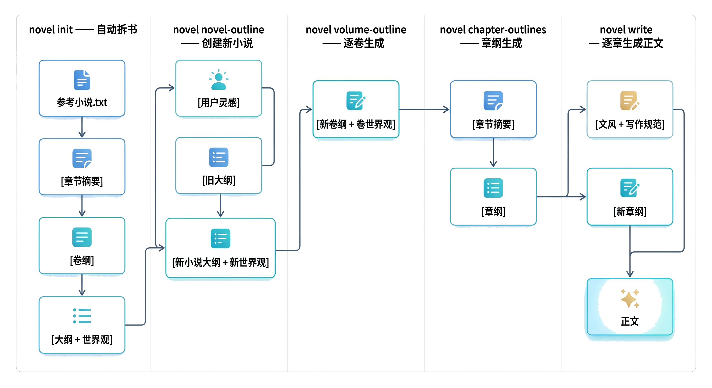

English | [中文](README.md)

<p align="center">
  
  &nbsp;&nbsp;
  
</p>

<h2 align="center">AI Agent for Long-form Web Novel Writing</h2>

<div align="center">

[](https://www.python.org/)
[](LICENSE)

</div>

***

<h3 align="center">Teach AI to Write Great Web Novels</h3>

<p align="center">
  An AI-powered tool for high-quality web novel creation. Through a two-stage "Deconstruct + Imitate" workflow, it significantly improves the quality of AI-generated fiction.
</p>

***

## Background

Most AI novel writing tools on the market share these common problems:

- **Weak worldbuilding**: Relying solely on LLM generation, they struggle to create logically consistent, detailed, and rigorous world settings without sufficient context.
- **Generic and unoriginal**: Trained on massive average-quality corpora, models tend to output "average" content, resulting in flat characters, cliched plots, and lack of uniqueness.
- **Lack of aesthetic judgment**: AI training lacks clear definitions of good vs. bad fiction, so generated content reads like novels but falls short of truly good novels.

**harnessNovel's solution: Deconstruct first, then imitate.**

Instead of letting AI create from scratch, it first systematically learns from an excellent novel, then creates with a solid foundation.

## Core Features

**Structured Novel Deconstruction**

Supports multi-granularity analysis of excellent web novels, extracting:

- Full book outline
- Complete worldbuilding (rules, factions, power systems, backgrounds)
- Volume outlines
- Chapter summaries
- Key plot pacing and emotional beats

**High-Quality Imitative Writing**

Uses deconstructed results as context, combined with user inspiration, to generate:

- Full book outline
- Worldbuilding framework
- Volume outlines
- Detailed chapter outlines
- Full text content

**Writing Style & Norms**

Deeply analyzes and extracts writing style characteristics from multiple novels, helping remove the "AI flavor":

- Language style (word choice habits, rhetorical preferences)
- Narrative pacing and POV control
- Emotional expression and detail density
- Dialogue style and character voices
- Overall writing conventions

**Flexible LLM Support**

Supports Claude, GPT-4o, DeepSeek, Qwen, and other mainstream models.

## Workflow

1. **Deconstruct**: Select a high-quality novel and deconstruct it into structured knowledge with one click.
2. **Imitate**: Input your core inspiration + deconstructed results, letting AI create "standing on the shoulders of giants."
3. **Iterate**: Adjust outlines, world settings, and chapter content at any time to gradually refine your work.

<p align="center">
  
</p>

## Features

- **Fully automated**: From deconstruction to text generation, complete a full-length novel with 5 commands
- **Reference-based imitation**: Generates new content based on the reference novel's pacing, structure, and tension curves
- **Batch summarization**: 20 chapters per batch, maintaining long-term plot coherence
- **Progressive worldbuilding**: Full book worldbuilding → per-volume worldbuilding, refining settings as the plot advances
- **Resume from breakpoint**: All stages automatically skip generated content, supporting resume after interruption

## Requirements

- Python 3.9+
- LLM API with OpenAI-compatible interface (DeepSeek, Zhipu GLM, Kimi, etc.)

## Installation

```bash
pip install harnessNovel
```

The `novel` command will be globally available after installation.

## Configuration

```bash
novel config
```

This creates a global config file at `~/.harnessNovel/.env`. Edit it with your API keys:

```ini
# Reference novel batch summarization (flash model recommended for speed and cost)
DATA_BUILDER_MODEL=deepseek-chat
DATA_BUILDER_BASE_URL=https://api.deepseek.com
DATA_BUILDER_API_KEY=your-api-key

# Adaptive auxiliary tasks: worldbuilding extraction (flash model recommended)
ADAPTIVE_BUILDER_LITE_MODEL=deepseek-chat
ADAPTIVE_BUILDER_LITE_BASE_URL=https://api.deepseek.com
ADAPTIVE_BUILDER_LITE_API_KEY=your-api-key

# Adaptive core tasks: outlines, volume outlines, chapter outlines, text (pro model recommended for quality)
ADAPTIVE_BUILDER_MODEL=deepseek-chat
ADAPTIVE_BUILDER_BASE_URL=https://api.deepseek.com
ADAPTIVE_BUILDER_API_KEY=your-api-key
```

You can also override configuration via environment variables with the same names. Each config group can use different models and providers.

## Quick Start

```bash
# 1. Initialize workspace (auto-deconstruct: chapter splitting → batch summary → smart volume segmentation → worldbuilding extraction)
novel init my-novel --txt reference-novel.txt

# 2. Generate new novel outline + full book worldbuilding
novel novel-outline my-novel

# 3. Generate volume outline + per-volume worldbuilding
novel volume-outline my-novel --volume 1

# 4. Generate batch summaries + chapter outlines
novel chapter-outlines my-novel --volume 1

# 5. Generate text
novel write my-novel --volume 1
```

## Notes

- Reference novels currently only support .txt format with UTF-8 encoding

## Command Reference

| Command                                                               | Description                                      |
| --------------------------------------------------------------------- | ------------------------------------------------- |
| `novel config`                                                        | Initialize global config file                     |
| `novel list`                                                          | List all workspaces                               |
| `novel init <ws> --txt <path> [--batch-size N]`                       | Create workspace, auto-deconstruct + worldbuilding |
| `novel novel-outline <ws> [--direction TEXT] [--direction-file PATH]` | Generate novel outline and full book worldbuilding |
| `novel volume-outline <ws> [--volume N] [--force]`                    | Generate volume outline and per-volume worldbuilding |
| `novel chapter-outlines <ws> [--volume N] [--force]`                  | Two-stage: batch summary → chapter outlines       |
| `novel write <ws> [--volume N] [--start N] [--max N]`                 | Generate text content                             |

### Parameter Details

- `--txt <path>`: Reference novel file path (init only)
- `--batch-size N`: Chapters per batch, default 20 (init only)
- `--direction TEXT`: Creative direction, e.g. "change to modern urban setting" (novel-outline only)
- `--direction-file PATH`: Read creative direction from file (novel-outline only)
- `--volume N`: Volume number, default 1
- `--start N`: Starting chapter number, default 1 (write only)
- `--max N`: Maximum chapters to generate (write only)
- `--force`: Force regeneration, overwriting existing content

## Author

飞鸟 one the way — Explorer

## License

[GPL-3.0](LICENSE)
